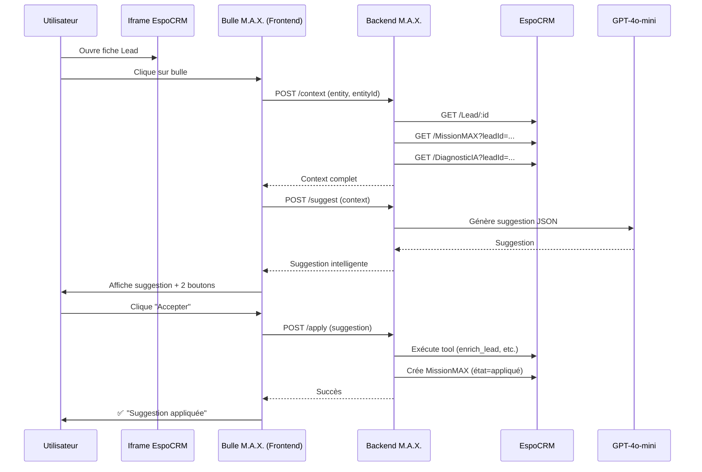

# 🫧 Architecture Bulle M.A.X. - Documentation Complète

**Date** : 23 novembre 2025
**Status** : ✅ Backend COMPLÉTÉ - Frontend À IMPLÉMENTER

---

## 🎯 Vision : Une Intelligence, Plusieurs Interfaces

### Principe Fondamental

**M.A.X. = Un seul cerveau, plusieurs interfaces**

1. **Bulle M.A.X.** (dans EspoCRM) = Interface contextuelle (focus sur UN lead/compte)
2. **Chat M.A.X.** (dans l'application) = Interface globale
3. **Source unique de vérité** = CRM (pas l'historique conversationnel)

---

## 🔄 Synchronicité Totale

### Règles Obligatoires

1. **Toute action de la bulle** → crée une `MissionMAX` avec :
   - `leadId` ou `accountId`
   - `typeAction` (enrichissement, tag, diagnostic, email, etc.)
   - `resultat`
   - `statutExecution` (proposé, appliqué, refusé)
   - `timestamp`

2. **Le chat M.A.X. relit UNIQUEMENT** :
   - Le Lead/Account (API Espo)
   - Les MissionMAX associées
   - Les DiagnosticIA associés
   - ❌ PAS l'historique de conversation

3. **Mémoire CRM = Mémoire M.A.X.**

---

## 🛠️ Tools Créés

### 1. `create_email_template`

**Objectif** : Créer automatiquement un template d'email dans EspoCRM

**Paramètres** :
```json
{
  "name": "Nom du template",
  "subject": "Sujet de l'email",
  "bodyHtml": "<p>Corps HTML</p>",
  "category": "MaCréa CORE" // default
}
```

**Utilisation** :
```
User: "Crée-moi un template de relance pour lead chaud"
M.A.X.: [Génère HTML] + [Appelle create_email_template] → Template enregistré dans EspoCRM
```

---

### 2. `get_missions_for_lead`

**Objectif** : Récupérer l'historique des actions M.A.X. pour un lead

**Paramètres** :
```json
{
  "leadId": "abc123",
  "limit": 10,          // default: 10
  "orderBy": "dateExecution",  // default
  "order": "desc"       // default
}
```

**Retour** :
```json
{
  "success": true,
  "leadId": "abc123",
  "total": 15,
  "count": 10,
  "missions": [
    {
      "id": "mission1",
      "name": "Enrichissement IA - Lead Assurance",
      "typeAction": "enrichissement",
      "resultat": "Secteur: Assurance, Score: 75",
      "statutExecution": "Réussi",
      "dateExecution": "2025-11-23T14:30:00Z",
      "tokensUtilises": 450
    }
  ]
}
```

**Utilisation dans le chat** :
```
User: "Qu'as-tu fait pour ce lead récemment ?"
M.A.X.: [Appelle get_missions_for_lead] → "Voici mes 10 dernières actions..."
```

---

## 🌐 APIs Bulle M.A.X.

### Architecture des Endpoints

```
/api/max/bubble/context   → POST  Charger le contexte (entity + ID)
/api/max/bubble/suggest   → POST  Générer suggestion intelligente
/api/max/bubble/apply     → POST  Appliquer suggestion
```

---

### 1. POST `/api/max/bubble/context`

**Objectif** : Recevoir le contexte depuis l'iframe EspoCRM

**Body** :
```json
{
  "entity": "Lead",
  "entityId": "abc123"
}
```

**Réponse** :
```json
{
  "ok": true,
  "context": {
    "entity": "Lead",
    "entityId": "abc123",
    "record": { /* Données du lead */ },
    "missions": [ /* 10 dernières missions */ ],
    "diagnostic": { /* Dernier diagnostic IA */ },
    "timestamp": "2025-11-23T15:00:00Z"
  }
}
```

**Actions backend** :
1. Récupère le Lead depuis EspoCRM
2. Récupère les 10 dernières MissionMAX
3. Récupère le dernier DiagnosticIA (si existe)
4. Log l'activité

---

### 2. POST `/api/max/bubble/suggest`

**Objectif** : Générer une suggestion intelligente basée sur le contexte

**Body** :
```json
{
  "context": { /* Context from /context */ }
}
```

**Réponse** :
```json
{
  "ok": true,
  "suggestion": {
    "type": "enrichissement",
    "titre": "Enrichir les tags du lead",
    "description": "Je peux ajouter des tags stratégiques : #assurance-vie, #PER, #lead-chaud",
    "action": {
      "tool": "enrich_lead_universal",
      "params": {
        "leadId": "abc123",
        "tagsIA": ["#assurance-vie", "#PER", "#lead-chaud"],
        "scoreIA": 75
      }
    }
  },
  "timestamp": "2025-11-23T15:01:00Z"
}
```

**Actions backend** :
1. Construit un prompt pour M.A.X. avec tout le contexte
2. Appelle GPT-4o-mini pour générer la suggestion
3. Parse la réponse JSON
4. Log l'activité
5. Retourne la suggestion

**Prompt M.A.X.** :
```
Tu es M.A.X., l'assistant IA du CRM MaCréa.

CONTEXTE :
- Entity : Lead
- Record : {...}
- Missions récentes : 5 missions
- Diagnostic IA récent : {...}

MISSION :
Génère UNE suggestion intelligente et concrète.

Format JSON uniquement :
{
  "type": "enrichissement|tag|statut|action|email",
  "titre": "Titre court",
  "description": "Description détaillée",
  "action": {
    "tool": "nom_du_tool",
    "params": { ... }
  }
}
```

---

### 3. POST `/api/max/bubble/apply`

**Objectif** : Appliquer une suggestion (exécuter le tool)

**Body** :
```json
{
  "suggestion": { /* Suggestion from /suggest */ },
  "context": { /* Context */ }
}
```

**Réponse** :
```json
{
  "ok": true,
  "message": "Suggestion appliquée avec succès",
  "timestamp": "2025-11-23T15:02:00Z"
}
```

**Actions backend** :
1. Extrait le tool et params de la suggestion
2. **TODO** : Appelle `executeToolCall` depuis chat.js
3. Crée une MissionMAX avec état = "appliqué"
4. Log l'activité
5. Retourne le résultat

---

## 🎨 Flow Utilisateur (Bulle M.A.X.)

### Scénario : L'utilisateur consulte un Lead dans EspoCRM



---

## 📁 Fichiers Créés

### Backend

1. **`max_backend/lib/maxTools.js`**
   - Ajout de `create_email_template` (lignes 771-800)
   - Ajout de `get_missions_for_lead` (lignes 801-832)

2. **`max_backend/routes/chat.js`**
   - Handler `create_email_template` (lignes 2553-2596)
   - Handler `get_missions_for_lead` (lignes 2598-2651)

3. **`max_backend/routes/bubble.js`** ← NOUVEAU
   - POST `/context` - Charger contexte
   - POST `/suggest` - Générer suggestion
   - POST `/apply` - Appliquer suggestion

4. **`max_backend/server.js`**
   - Import `bubbleRouter` (ligne 38)
   - Mount `/api/max/bubble` (ligne 62)

---

## 🚀 Prochaines Étapes

### Frontend (À IMPLÉMENTER)

1. **Créer composant `MaxBubble.jsx`**
   - Bouton flottant en bas à droite dans EspoCRM
   - Récupère `leadId` depuis l'URL de l'iframe
   - Appelle `/api/max/bubble/context`

2. **Interface de suggestion**
   - Affiche la suggestion générée
   - 2 boutons : "Accepter" / "Refuser"
   - Appelle `/api/max/bubble/apply` si accepté

3. **Communication Iframe ↔ React**
   - `postMessage` depuis EspoCRM vers React
   - React écoute le message et ouvre la bulle

### Backend (TODO)

1. **Refactoring `executeToolCall`**
   - Extraire dans un module séparé
   - Importer dans `bubble.js` pour `/apply`

2. **Amélioration du prompt `/suggest`**
   - Ajouter plus de contexte (emails, activités)
   - Personnaliser selon le secteur

3. **IMAP Integration**
   - Vérifier config IMAP dans EspoCRM
   - Créer tool `get_lead_emails`
   - Intégrer dans le contexte de la bulle

---

## 🎯 Résumé

**Ce qui est FAIT** :
- ✅ 2 Tools créés (`create_email_template`, `get_missions_for_lead`)
- ✅ 3 APIs créées (`/context`, `/suggest`, `/apply`)
- ✅ Architecture synchronisée (CRM = source de vérité)
- ✅ Logging de toutes les actions

**Ce qui reste À FAIRE** :
- ⏳ Frontend de la bulle M.A.X.
- ⏳ Refactoring `executeToolCall`
- ⏳ IMAP integration
- ⏳ Tests end-to-end

---

**M.A.X. est maintenant prêt à devenir contextuel et intelligent ! 🧠✨**
