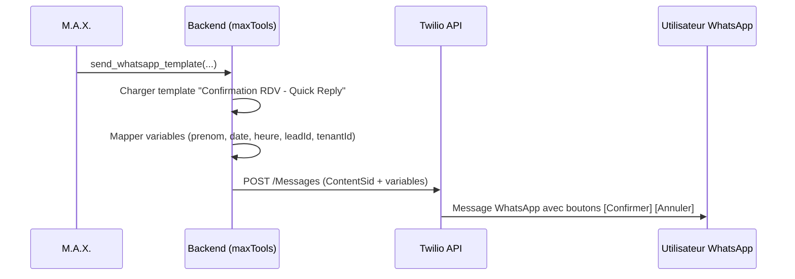
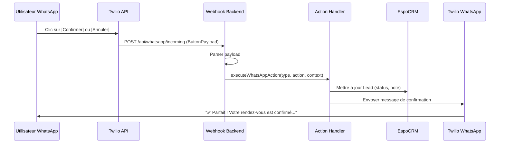

# Flux WhatsApp avec Boutons Interactifs

## Vue d'ensemble

Ce document décrit le flux complet pour envoyer des messages WhatsApp avec boutons interactifs (Quick Reply) et gérer les réponses utilisateurs.

**Architecture:**
- **Envoi de templates**: Backend direct via `send_whatsapp_template` (M.A.X.)
- **Réception des clics**: Webhook Twilio → Backend → Actions métier
- **Logique métier**: Handlers dans `config/whatsapp-actions.js`
- **n8n**: Réservé uniquement aux automatisations multi-étapes (wait/cron/conditions)

---

## 🎯 Flux Complet

### 1. M.A.X. Envoie un Template avec Boutons



**Exemple d'appel M.A.X.:**
```javascript
send_whatsapp_template({
  messageName: "Confirmation RDV - Quick Reply",
  leadIdentifier: "Jean Dupont",
  variables: {
    date: "15/12/2025",
    heure: "14h30"
  }
})
```

**Template utilisé:**
- **ContentSid**: `HXd70815ab2465aaed6ab72fde5018021a`
- **Variables**: `prenom`, `date`, `heure`, `leadId`, `tenantId`
- **Boutons**:
  - ✅ Confirmer → payload: `confirm|tenant=macrea|contact=LEAD_ID|type=appointment`
  - ❌ Annuler → payload: `cancel|tenant=macrea|contact=LEAD_ID|type=appointment`

---

### 2. Utilisateur Clique sur un Bouton



**Webhook Twilio → Backend:**
```http
POST /api/whatsapp/incoming
Content-Type: application/x-www-form-urlencoded

MessageSid=SMxxxx
From=whatsapp:+33648662734
To=whatsapp:+14155238886
ButtonPayload=confirm|tenant=macrea|contact=LEAD_123|type=appointment
```

---

## 📋 Payload Standardisé

### Format
```
{action}|tenant={tenantId}|contact={leadId}|type={type}
```

### Exemples
```
confirm|tenant=macrea|contact=abc123|type=appointment
cancel|tenant=macrea|contact=abc123|type=appointment
reschedule|tenant=macrea|contact=abc123|type=appointment
```

### Parsing
```javascript
function parseButtonPayload(payload) {
  const parts = payload.split('|');
  const parsed = {};

  parts.forEach(part => {
    const [key, value] = part.split('=');
    if (key && value) {
      parsed[key] = value;
    } else {
      parsed.action = part; // Premier élément sans '='
    }
  });

  return parsed;
}
```

Résultat:
```javascript
{
  action: 'confirm',
  tenant: 'macrea',
  contact: 'abc123',
  type: 'appointment'
}
```

---

## ⚙️  Actions Métier (Handlers)

### Handler: Confirmer RDV

**Fichier:** `config/whatsapp-actions.js:handleAppointmentConfirm`

**Actions exécutées:**
1. ✅ Mettre à jour le Lead dans EspoCRM:
   - `status` → `"In Process"`
   - `description` → "Rendez-vous confirmé via WhatsApp le {date}"

2. 📝 Créer une Note EspoCRM:
   - `name` → "Rendez-vous confirmé"
   - `post` → "Le contact a confirmé le rendez-vous via WhatsApp..."
   - `parentType` → "Lead"
   - `parentId` → `{leadId}`

3. 📤 Envoyer un message WhatsApp de confirmation:
   - Message: "✅ Parfait ! Votre rendez-vous est confirmé.\n\nNous avons hâte de vous rencontrer !"

**Retour:**
```javascript
{
  success: true,
  message: 'Rendez-vous confirmé avec succès',
  updates: {
    status: 'In Process',
    noteCreated: true,
    confirmationSent: true
  }
}
```

---

### Handler: Annuler RDV

**Fichier:** `config/whatsapp-actions.js:handleAppointmentCancel`

**Actions exécutées:**
1. ❌ Mettre à jour le Lead dans EspoCRM:
   - `status` → `"Dead"`
   - `description` → "Rendez-vous annulé via WhatsApp le {date}"

2. 📝 Créer une Note EspoCRM:
   - `name` → "Rendez-vous annulé"
   - `post` → "Le contact a annulé le rendez-vous via WhatsApp..."

3. 📤 Envoyer un message WhatsApp d'annulation:
   - Message: "Votre rendez-vous a bien été annulé.\n\nSi vous souhaitez reprogrammer, n'hésitez pas à nous contacter."

**Retour:**
```javascript
{
  success: true,
  message: 'Rendez-vous annulé',
  updates: {
    status: 'Dead',
    noteCreated: true,
    confirmationSent: true
  }
}
```

---

## 🧪 Tests

### Test Automatique (Simulation)

Exécuter le script de test qui simule le flux complet:

```bash
# Tester la confirmation
node scripts/test-whatsapp-buttons-flow.js confirm

# Tester l'annulation
node scripts/test-whatsapp-buttons-flow.js cancel
```

**Ce script:**
1. Envoie un template WhatsApp avec boutons
2. Simule un clic sur le bouton choisi
3. Exécute l'action métier correspondante
4. Vérifie les mises à jour dans EspoCRM

---

### Test Manuel (Réel)

**Prérequis:**
- Serveur backend démarré (`npm run dev`)
- Ngrok ou tunnel exposant `http://localhost:3005`
- Webhook Twilio configuré: `https://YOUR_NGROK_URL/api/whatsapp/incoming`

**Étapes:**

1. **Envoyer un template via M.A.X.:**
   - Ouvrir l'interface M.A.X.
   - Demander: "Envoie une confirmation de RDV à Jean Dupont pour le 15/12 à 14h30"
   - M.A.X. utilise `send_whatsapp_template` automatiquement

2. **Vérifier réception WhatsApp:**
   - Ouvrir WhatsApp sur le téléphone de test
   - Vérifier la réception du message avec boutons

3. **Cliquer sur un bouton:**
   - Cliquer sur "✅ Confirmer" ou "❌ Annuler"

4. **Vérifier les actions:**
   - **Backend logs**: Consulter les logs du serveur pour voir l'exécution du handler
   - **EspoCRM**: Ouvrir le lead et vérifier:
     - Statut mis à jour
     - Note créée
   - **WhatsApp**: Vérifier la réception du message de confirmation automatique

---

## 🔧 Configuration Twilio

### Webhook Entrant

**URL:** `https://YOUR_DOMAIN/api/whatsapp/incoming`

**Événements à configurer:**
- ✅ Message incoming (quand un utilisateur répond)
- ✅ Message status (delivered, read, failed)

**Configuration dans Twilio Console:**
1. Accéder à: Messaging → Settings → WhatsApp Sandbox
2. Section "WHEN A MESSAGE COMES IN"
3. Entrer l'URL du webhook
4. Méthode: `POST`
5. Sauvegarder

---

## 📁 Fichiers Clés

### Backend

- **`routes/whatsapp-webhook.js`**: Webhook entrant Twilio, reçoit les clics boutons
- **`config/whatsapp-actions.js`**: Handlers des actions métier (confirm, cancel, etc.)
- **`config/whatsapp-message-presets.js`**: Templates avec ContentSid et payloads
- **`services/whatsappSendService.js`**: Service d'envoi via Twilio API
- **`lib/maxTools.js`**: Outil `send_whatsapp_template` pour M.A.X.

### Scripts

- **`scripts/test-whatsapp-buttons-flow.js`**: Test complet du flux
- **`scripts/load-whatsapp-presets.js`**: Charger les presets dans la DB

---

## 🎨 Ajouter un Nouveau Type de Bouton

### 1. Créer le Handler

**Fichier:** `config/whatsapp-actions.js`

```javascript
async function handleMyNewAction({ tenantId, leadId, payload, from }) {
  console.log(`   🎯 [my_type.my_action] Lead ${leadId}`);

  try {
    // 1. Mettre à jour EspoCRM
    await espoFetch(`/Lead/${leadId}`, {
      method: 'PUT',
      headers: { 'Content-Type': 'application/json' },
      body: JSON.stringify({
        // Vos mises à jour
      })
    });

    // 2. Créer une note
    await espoFetch('/Note', {
      method: 'POST',
      headers: { 'Content-Type': 'application/json' },
      body: JSON.stringify({
        name: 'Nom de la note',
        post: 'Description...',
        parentType: 'Lead',
        parentId: leadId
      })
    });

    // 3. Envoyer message de confirmation (optionnel)
    await sendSimpleWhatsAppMessage(from, 'Votre message de confirmation');

    return {
      success: true,
      message: 'Action réussie',
      updates: { ... }
    };

  } catch (error) {
    return {
      success: false,
      message: error.message,
      updates: {}
    };
  }
}
```

### 2. Enregistrer le Handler

```javascript
export const ACTION_HANDLERS = {
  // ... handlers existants
  my_type: {
    my_action: handleMyNewAction
  }
};
```

### 3. Créer le Template

**Fichier:** `config/whatsapp-message-presets.js`

```javascript
{
  id: 'my_template_v1',
  tenantId: 'macrea',
  name: 'Mon Template',
  type: 'my_type',
  templateName: 'my_template_v1',
  contentSid: 'HXxxxxxxxxxxxxxxxxxxxxxxxxxx', // Votre ContentSid Twilio
  variables: ['var1', 'var2', 'leadId', 'tenantId'],
  mode: 'quick_reply',
  buttons: [
    {
      type: 'QUICK_REPLY',
      text: 'Bouton 1',
      payload: 'my_action|tenant={{4}}|contact={{3}}|type=my_type'
    }
  ],
  messageText: 'Votre message avec {{var1}} et {{var2}}',
  description: 'Description du template'
}
```

---

## 🔍 Debugging

### Activer les Logs Détaillés

Les logs sont automatiquement affichés dans la console du serveur backend.

**Webhook entrant:**
```
================================================================================
📲 WEBHOOK WHATSAPP ENTRANT
================================================================================
📋 Données reçues:
   From: whatsapp:+33648662734
   To: whatsapp:+14155238886
   Body:
   ButtonPayload: confirm|tenant=macrea|contact=abc123|type=appointment
   MessageSid: SMxxxx

🔘 CLIC SUR BOUTON DÉTECTÉ
📦 Payload parsé: { action: 'confirm', tenant: 'macrea', contact: 'abc123', type: 'appointment' }

🎯 Action: confirm
   Tenant: macrea
   Contact: abc123
   Type: appointment
   Phone: +33648662734

   ✅ [appointment.confirm] Lead abc123 (Tenant: macrea)
   ✅ Lead abc123 mis à jour avec succès
   📤 Message de confirmation envoyé à +33648662734
   ✅ Rendez-vous confirmé avec succès
✅ Webhook traité avec succès
================================================================================
```

### Vérifier les Templates Chargés

```bash
node scripts/list-whatsapp-templates.js
```

### Vérifier la Route Webhook

```bash
curl http://localhost:3005/api/whatsapp/status
```

Réponse attendue:
```json
{
  "status": "ok",
  "service": "whatsapp-webhook",
  "timestamp": "2025-12-12T..."
}
```

---

## ✅ Checklist Déploiement

- [ ] Templates WhatsApp approuvés par Meta/Twilio
- [ ] ContentSid configurés dans `whatsapp-message-presets.js`
- [ ] Presets chargés dans la DB: `node scripts/load-whatsapp-presets.js`
- [ ] Webhook Twilio configuré: `https://YOUR_DOMAIN/api/whatsapp/incoming`
- [ ] Variables d'environnement configurées:
  - `TWILIO_ACCOUNT_SID`
  - `TWILIO_AUTH_TOKEN`
  - `TWILIO_WHATSAPP_FROM`
- [ ] Serveur backend accessible publiquement (ngrok ou production)
- [ ] Tests effectués: `node scripts/test-whatsapp-buttons-flow.js`
- [ ] Logs vérifiés dans la console backend

---

## 🚀 Prochaines Étapes

### Phase 2: Extensions Possibles

1. **Rappels J-1 automatiques via n8n:**
   - Workflow n8n: cron trigger → vérifier RDV confirmés → envoyer rappel 24h avant

2. **Reprogrammation assistée:**
   - Bouton "Reprogrammer" → M.A.X. propose des créneaux disponibles

3. **Webhooks sortants (notifications M.A.X.):**
   - Notifier M.A.X. en temps réel quand un bouton est cliqué
   - M.A.X. peut déclencher d'autres actions contextuelles

4. **Analytics:**
   - Tableau de bord: taux de confirmation, taux d'annulation
   - Suivi des performances par template

---

## 📞 Support

Pour toute question ou problème:
1. Consulter les logs du serveur backend
2. Vérifier la configuration Twilio
3. Tester avec `scripts/test-whatsapp-buttons-flow.js`
4. Consulter `docs/WHATSAPP_WORKFLOW.md` pour plus de détails
