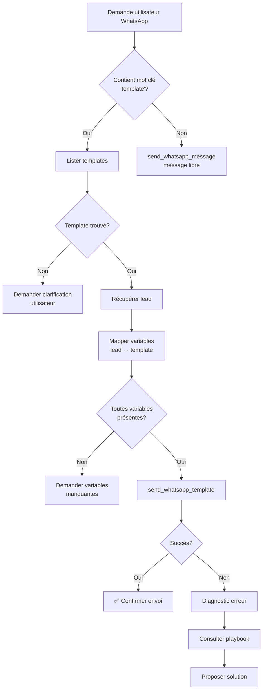

# 📱 PLAYBOOK: Échec d'Envoi WhatsApp

## Symptômes
- Message "Test message" au lieu du template configuré
- Erreur `ECONNREFUSED 127.0.0.1:5678` (n8n non démarré)
- Erreur Twilio (credentials, numéro invalide, etc.)
- Template non trouvé

## Diagnostic Étape par Étape

### 1️⃣ Vérifier que n8n est démarré

**Erreur typique**:
```
Error: connect ECONNREFUSED 127.0.0.1:5678
```

**Solution**:
```bash
# Vérifier si n8n tourne
netstat -ano | findstr :5678

# Si rien, démarrer n8n
npx n8n
```

**Message M.A.X. à l'utilisateur**:
```
❌ Je ne peux pas envoyer le WhatsApp car n8n n'est pas démarré.

🔧 **Solution rapide**:
Demandez à votre administrateur de démarrer n8n avec:
```bash
npx n8n
```

Ou dites-moi "démarre n8n" et je vais essayer de le faire pour vous.
```

### 2️⃣ Stratégie de Sélection Automatique des Outils

**RÈGLE D'OR**: M.A.X. doit TOUJOURS privilégier les templates professionnels.

| Demande Utilisateur | 🎯 Outil à Utiliser | Raison |
|---------------------|---------------------|---------|
| "Envoie une confirmation RDV" | `send_whatsapp_template` | Template "Confirmation RDV" existe |
| "Relance ce lead" | `send_whatsapp_template` | Template "Relance J+3" existe |
| "Rappelle-lui son RDV" | `send_whatsapp_template` | Template "Rappel RDV" existe |
| "Dis-lui bonjour et demande comment il va" | `send_whatsapp_message` | Message totalement personnalisé |
| "Envoie un WhatsApp" (vague) | `send_whatsapp_template` | Par défaut, chercher template approprié |

**Workflow de Décision M.A.X.**:
```
1. Utilisateur demande envoi WhatsApp
2. M.A.X. analyse le contexte (lead, historique, type de demande)
3. M.A.X. cherche dans list_whatsapp_templates() si template approprié
4. SI template trouvé → send_whatsapp_template
5. SINON → send_whatsapp_message en dernier recours
```

### 3️⃣ Vérifier que le template existe

**Avant d'utiliser `send_whatsapp_template`, M.A.X. DOIT**:
1. Lister les templates disponibles avec `list_whatsapp_templates`
2. Chercher le template par nom (fuzzy match acceptable)
3. Si introuvable, demander clarification à l'utilisateur

**Exemple**:
```javascript
// 1. Lister
const templates = await list_whatsapp_templates({ status: 'active' });

// 2. Chercher
const template = templates.find(t =>
  t.name.toLowerCase().includes('confirmation') &&
  t.name.toLowerCase().includes('rdv')
);

// 3. Si introuvable
if (!template) {
  return `❌ Je n'ai pas trouvé de template "Confirmation RDV".

📋 **Templates disponibles**:
${templates.map(t => `- ${t.name}`).join('\n')}

Lequel voulez-vous utiliser?`;
}
```

### 4️⃣ Vérifier les variables du template

**Erreur fréquente**: Variables manquantes ou mal nommées

```javascript
// Template attend: {prenom, date, heure}
// M.A.X. envoie: {firstName, appointmentDate, appointmentTime}
// ❌ ÉCHEC car noms ne correspondent pas
```

**Solution - Auto-mapping**:
```javascript
// Utiliser whatsappVariableMapper.js
const mappedVars = mapLeadToTemplateVariables(lead, template.variables);

// Exemple:
// template.variables = ['prenom', 'date', 'heure']
// lead = { firstName: 'Malala', ... }
// mappedVars = { prenom: 'Malala', date: '20/12/2025', heure: '15h' }
```

### 5️⃣ Format du numéro de téléphone

**Formats acceptés**:
- ✅ `+33648662734` (international avec +)
- ✅ `whatsapp:+33648662734` (format Twilio)
- ❌ `0648662734` (nécessite conversion)
- ❌ `06 48 66 27 34` (espaces à retirer)

**Auto-correction M.A.X.**:
```javascript
// Avant d'envoyer, toujours nettoyer:
phone = formatPhoneNumber(lead.phoneNumber);
// Retourne: whatsapp:+33648662734
```

### 6️⃣ Credentials Twilio

**Erreur typique**:
```
Twilio Error 20003: Authentication failed
```

**Vérifier dans .env**:
```bash
TWILIO_ACCOUNT_SID=ACxxxxxxxxxxxxxxxxx
TWILIO_AUTH_TOKEN=your_auth_token
TWILIO_WHATSAPP_FROM=whatsapp:+14155238886
```

**Message M.A.X.**:
```
❌ Échec d'authentification Twilio.

🔐 **Action requise**:
Vérifiez que les credentials Twilio sont configurés dans le fichier .env:
- TWILIO_ACCOUNT_SID
- TWILIO_AUTH_TOKEN
- TWILIO_WHATSAPP_FROM

Contactez votre administrateur système.
```

## Workflow de Décision M.A.X.



## Messages Types pour l'Utilisateur

### Succès Template
```
✅ **Message WhatsApp envoyé!**

📱 **Destinataire**: Malala (+33648662734)
📋 **Template**: Confirmation de Rendez-vous
📄 **Variables**:
  - Prénom: Malala
  - Date: 20 décembre 2025
  - Heure: 15h

Le message a été envoyé via Twilio. Vous recevrez une confirmation de livraison sous quelques secondes.
```

### Échec avec Diagnostic
```
❌ **Impossible d'envoyer le WhatsApp**

🔍 **Diagnostic**:
- Template: Confirmation RDV ✅
- Numéro destinataire: +33648662734 ✅
- Variables: prenom, date, heure ✅
- ⚠️ Problème: n8n ne répond pas (port 5678)

💡 **Solution**:
n8n doit être démarré pour que les workflows WhatsApp fonctionnent.

🛠️ **Actions possibles**:
1. Je peux essayer de démarrer n8n automatiquement
2. Vous pouvez démarrer n8n manuellement
3. Vous pouvez demander à l'admin système

Que souhaitez-vous faire?
```

### Clarification Nécessaire
```
🤔 **J'ai besoin de précisions**

Vous m'avez demandé d'envoyer un "message de confirmation" à Malala.

📋 **Templates disponibles**:
1. **Confirmation de Rendez-vous** (WhatsApp)
   Variables: prénom, date, heure

2. **Confirmation de Commande** (Email)
   Variables: prénom, numéro commande, total

Lequel voulez-vous utiliser? Ou souhaitez-vous que j'envoie un message libre?
```

## Code d'Implémentation

```javascript
// Dans maxTools.js - Intelligence de sélection d'outil

async function sendWhatsAppIntelligent(userRequest, leadId) {
  // 1. Analyser l'intent
  const isTemplate = /template|confirmation|relance|rappel/i.test(userRequest);

  if (isTemplate) {
    // 2. Lister templates
    const templates = await list_whatsapp_templates({ status: 'active' });

    // 3. Fuzzy match
    const match = findBestTemplateMatch(userRequest, templates);

    if (!match) {
      return {
        needsClarification: true,
        availableTemplates: templates,
        prompt: `Je n'ai pas trouvé de template correspondant. Lequel voulez-vous utiliser?\n\n${templates.map(t => `- ${t.name}`).join('\n')}`
      };
    }

    // 4. Récupérer lead
    const lead = await get_lead(leadId);

    // 5. Mapper variables
    const variables = mapLeadToTemplateVariables(lead, match.variables);

    // 6. Vérifier variables manquantes
    const missing = match.variables.filter(v => !variables[v]);
    if (missing.length > 0) {
      return {
        needsInput: true,
        missingVariables: missing,
        prompt: `Pour envoyer ce template, j'ai besoin de: ${missing.join(', ')}. Pouvez-vous me les donner?`
      };
    }

    // 7. Envoyer
    return await send_whatsapp_template(match.name, leadId, variables);

  } else {
    // Message libre
    return await send_whatsapp_message(leadId, userRequest);
  }
}
```

## Monitoring et Alertes

### Logs à Créer
```javascript
// Logger chaque tentative
logWhatsAppAttempt({
  timestamp: Date.now(),
  leadId,
  templateName: template?.name,
  success: result.success,
  errorCode: result.error?.code,
  errorMessage: result.error?.message,
  retryCount: attempt
});
```

### Alertes Proactives
```javascript
// Si 3 échecs en 10 minutes sur même type d'erreur
if (recentFailures.length >= 3) {
  alertAdmin({
    type: 'WHATSAPP_RECURRING_FAILURE',
    error: mostCommonError,
    suggestion: playbooks[mostCommonError].solution
  });
}
```
